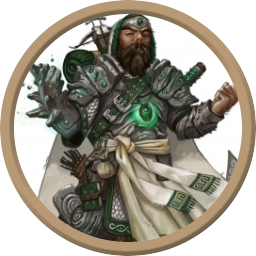
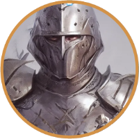
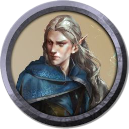

## Giocatori

**Burbit**

..background..

**Duca Ignazio di AlbaRadiante**

..background..

**Ruidjert**

..background..

## Logs

### Episodio 1 - Capitolo 1

* I nostri eroi dopo un lungo viaggio in barca sono giunti a *Sonno del Drago*.
* Hanno sconfitto i tre Zombie che si trovavano dietro di loro all'ingresso del Chiostro e sono stati accolti come degli eroi dai **Coboldi** e da **Runara**.
* Conversando con i Coboldi hanno scoperto che l'arrivo di questi Zombie è un evento che da diversi mesi è ricorrente sull'isola, tutto ciò a partire dal grande naufragio che è avvenuto mesi fa.
* Interagendo con Myla (cobolda alata ferita) hanno compreso il motivo delle sue ferite (sorta di uccelli vampiri) e la perdita dei suoi fratelli (se ne sono andati via per motivi ideologici).
* Conoscono Tarak (il quale è stato riconosciuto da **Burbit** come ladro appartenente alla famosa gilda "*La Forca Dorata*"), **Varnoth** (riconosciuta come generale del gruppo di mercenari *Lupi Azzurri*) e un misterioso paladino.
* **Varnoth** ha spiegato che secondo lei il grande botto è stato fatto da un relitto naufragato a nord dell'isola.
* Sono rimasti in direzione del *Tempio di Bahamut*, sono le 14:00 con bel tempo.

### Episodio 2 - Capitolo 2

* Sono andati in biblioteca e hanno conosciuto **Arvandus Stellabruna**.
* Hanno acquistato tre mappe per *1mo* ciascuna.
* Il **Duca** ha noleggiato il libro "*Le cicatrici di Sonno del Drago*".
* Sono andati a parlare con **Runara** ed ad esplorare il tempio.
* Hanno fatto un riposo lungo e al risveglio con l'aiuto dei coboldi si sono imbarcati in direzione delle grotte a partire dalla mezzanotte.
* I nostri eroi dopo una fase esplorativa di *Sonno del Drago* si sono diretti alle *Grotte di Micosina* per fermare la minaccia che ne blocca l'accesso.
* Arrivati all'ingresso delle grotte hanno sostenuto un lungo combattimento contro il **Polpo servitore delle Spore** che impediva l'accesso nella grotta, nel quale hanno avuto la meglio.
* Grazie alle abilità telepatiche dei **Miconidi**, i pensieri di tutti i giocatori e dei Miconidi sono condivisi.

### Episodio 3 - Capitolo 2

* I nostri eroi hanno compreso che la grotta è ammalata da un infestazione di spore.
* All'ingresso della grotta hanno una breve conversazione telepatica con dei **Miconidi** dopo aver sconfitto dei **Funghi Viola**.
* Vanno a conversare con dei **Miconidi Adulti** che si trovano sopra le cascate dello stagno, quest'ultimi gli forniscono dei *Funghi* a forma di cuore.
* Nella *Stanza circolare* viene *ucciso* uno dei **Miconidi Adulti** nell'atto di difendersi da un'aggressione impulsiva di quest'ultimo.
  * Gli altri Miconidi Adulti sono in uno stato di trance causato dalle spore.
* Il governante dei funghi **Sinensa** è gravemente ammalato, vi è un bioritmo tra la salute di questo e la salute delle **Grotte di Micosina.**
* **Spugnola rubino** viene recuperata da **Burbit** secondo i consigli degli aiutanti di **Sinensa**.
* Gli eroi decidono di non inoltrarsi ulteriormente nella *Dispensa* (a sud della *Stanza circolare*).
* Vengono sconfitti i due **Draghi di Fumo** guardiani della *Grotta di cristallo* dopo una durissima battaglia.
* Gli eroi si nascondono nel santuario di Sinensa per effettuare un riposo lungo alternandosi a turni di guardia per essere sicuri di non subire agguati durate il riposo.

### Episodio 4 - Capitolo 2

* I nostri eroi hanno sconfitto il **Serpente di Fuoco** che si era liberato dall'estrazione del *Cristallo arancione*.
* Hanno ottenuto il rispetto di **Sir Gavriel**, li ha introdotti alla sua missione di ricerca dell'**Orsogufo**.
* Hanno ottenuto 25 pezzi di ossidiana che si sono spartiti, **Ruidjert** ha trovato un *Anello d'Oro* con un rubino incastonato e **Burbit** ha trovato una **Spugnola Rubino** dietro alla cascata.
* **Duca** e **Ruidjert** hanno rispettivamente ordinato per 10mo dei libri su **Orsigufo** e magie d'evocazione.
* Vi sono stati molti dialoghi con **Runara** e gli eroi.
  * Essa andrà avvisata prima di recarsi al **Relitto della Rosa dei Venti**.
  * Ha mostrato sulla mappa dove potrebbe trovarsi ipoteticamente l'**Orsogufo**.
  * Ha mostrato dove si trova il **Relitto della Rosa dei Venti**.
* Sono le 17:00 di pomeriggio di Mercoledì.

### Episodio 5 - Capitolo 2

* I nostri eroi hanno passato del tempo a riposarsi a *Sonno del Drago* tra giochi di dadi, gare di rutti e birra.
* Iniziano a sospettare che **Runara** nascondi qualcosa, in quanto è sparita dal Tempio di *Sonno del Drago*.
* Il giorno dopo (Giovedì) si sono svegliati e hanno ricevuto delle nuove razioni da **Tarak** ed è arrivato il libro da Verdinverno ad Arvandus (ritirato dal Duca).
  * Non è stato trovato alcun testo a riguardo delle magie d'evocazione, le 10mo sono state restituite a **Ruidjert**.
* Sono andati a trovare **Runara** che è ricomparsa al tempio, ed ha spiegato a loro che capita qualche volta che si prenda del tempo per se per esplorare l'isola.
* I nostri eroi si stanno incamminando alla ricerca della nave naufragata che portava con se il circo con i rispettivi animali (tra cui l'**Orsogufo** cercato da **Sir Gavril**).
  * Per questo chiedono più informazioni a **Runara**.

### Episodio 6 - Capitolo 2

* I nostri erori si somno imbarcati alle 8:00 di mattina da *Sonno del Drago* per andare ad esplorare la zona dei naufragi nord delle isola.
* Nel viaggio si sono imbattuti in delle *Sorgenti termali*, una leggera corrente li ha attirati in questa bocca costruita da rocce basaltiche, una coltre di caldi vapori e fumi aleggia.
* Ruidjert riesce ad accorgersi di tre ombre che si trovano sotto questi vapori, si tratta di tre **Draghi di Fumo** che fanno da guardiano alle *Sorgenti termali*.
* Hanno sconfitto i tre **Draghi di Fumo** guardiani alle sorgenti termali, così sbloccando l'accesso alle acque sorgive e al giacimento di Spore del Vento.
  * Il Duca e Burbit hanno gambizzato e strappato ali ai **Draghi di Fumo**.
  * Il Duca ha lanciato un giavellotto in mezzo a gli occhi di un Drago di Fumo, quest'ultimo è rimasto incastrato li finchè Burbit con un colpo mancato (contro lo stesso drago) glielo ha spezzato.
* Le *Sorgenti termali* si scoprono essere un giacimento di **Spore del Vento** (funghi speciali che permettono di respirare sott'acqua), e anche di essere delle **Acque Sorgive** (1 Dado vita).
* Un giacimento oscuro nel mare viene avvistato, il gruppo di eroi pensa si possa trattare della nave degli artisti circensi che è affondata.
* La corrente trascina la barca verso le ultime scogliere più a nord, in quest'ultima posizione si trova un relitto di una nave naufragata (sembra essere accessibile).
* Tuttavia il gruppo vuole tornare indietro ad esplorare meglio il giacimento oscuro.
* Il giacimento oscuro nel mare che si pensava fosse il punto dove la nave degli artisti circensi affondò, si rivela essere una antica runa che attiva un **Mulinello Magico**.
* Il Duca si è calato con la fune dalla barca, quest'ultima era tenuta da Burbit, inoltre il suo giavellotto è stato incantato da Ruidjert per renderlo luminoso sott'acqua.
  * Il Duca giunge al fondo nel tentare di distruggere la runa la ha attivata, la runa si espande in un mastodontico ciclone nel cui occhio vi è il Duca, l'intera barca con il resto del gruppo viene coinvolta in questo impetuoso mulinello.
* Dopo una grande e difficoltosa prova di abilità da parte di tutti gli eroi, quest'ultimi si riescono a salvare saltando utilizzando l'effetto fionda del **Mulinello Magico**.
* Alle 11:00am (di Giovedì) si sono accampati alle *Sorgenti Termali* per riposare.

### Episodio 7 - Capitolo 3

* I nostri eroi sono ripartiti dall'accampamento, hanno tentato di tornare a Sonno del Drago, ma il vento li ha diretto verso il relitto della *Rosa dei Venti*.
* Dopo una perlustrazione iniziale hanno deciso di entrare da un buco in fondo alla stiva così recuperando il *Tesoro del Capitano*, contenente il *Diario del Capitano*.
  * Utilizzando le *Spore del Vento*.
* Hanno compreso dell'amore tra **Aleitha** e **Brastos** e della maledizione lanciata da **Orcus**, tutta via vogliono fare visionare il diario a **Runara**.
* Tornando nuovamente sulla loro barca, hanno deciso di perlustrare il relitto.
* Inizialmente hanno esaminato il *Ponte Superiore*, Ruidjert sbadatamente ha fatto cadere il timone, questo ha fatto innervosire gli Zombie che si trovavano nella stanza di sotto.
* Per evitare la fuoriuscita degli Zombie dalla stanza il Duca ha posizionato dei detriti che hanno fermato gli ingressi nel Ponte Principale.
  * Tuttavia gli Zombie sono usciti dando via ad una battaglia vinta dai nostri abili eroi.
* Hanno perlustrato tutte le stanze trovando qualche tesoro nella *Stanza del Capitano* (*bussola*, *55mo* e *strumenti da cartografo*) e una trappola sotto un'asse dei *Dormitori*.
  * Sotto l'asse vi era un altro tesoro nascosto, un sacco con 200mo.
* Scendendo nel *Ponte Inferiore* hanno dovuto sfidare due *Zombie* ed un *Ghoul* che si nascondeva dietro le scatole.
* Dopo averli sconfitti hanno prelevato dei tesori che si nascondevano in tre casse (*10 kg di chiodi di garofano*, *10 lingotti d'argento* e una *pergamena magica*).

### Episodio 8 - Capitolo 3

* Tentando di salpare dal relitto della *Rosa dei Venti* vengono aggrediti da due *Arpie*, avviene un feroce scontro tra il gruppo e quest'ultime. L'astuzia e la forza del gruppo li mette in serio vantaggio nonostante la forze e la feroce delle arpie. Ques'ultime sono diffidenti tra loro, ed il Duca ne instilla il dubbio, facendole combattere tra di loro. Alla fine Burbit riesce a prendere la zampa della prima, trattenendola. Quest'ultima supplica di lasciarla in vita, in cambio offrono un finto "tesoro" (50mr e 15 patate) con l'inganno, il quale è stato smascherato dal gruppo scaturendone la fuga di una delle due (non bloccata), alla fine mossi dalla pietà l'hanno lasciata in vita scappare.
* Riposo lungo, si risvegliano dopo degli incubi particolare ed è *Venerdì*.
  * Burbit sogna
  * Duca sogna
  * Ruidjert sogna
* Tornando parlano con Runara per scoprire di più su questo **Brastos**, comunica che l'intero equipaggio è stato sepolto in una cimitero a nord-est dell'isola, gli dice anche di controllare i censimenti con **Arvandus** per vedere se il cadavere di **Aleitha** fosse stato ritrovato.
  * Il nome di **Aleitha** non è presente nei censimenti.
  * Nel frattempo chiedono ad **Arvandus** della runa magica che hanno trovato in fondo al mare, riconosce la provenienza antica della magia e gli rivela che sicuramente non è originaria da qualche mago isolano e che quindi ha provenienze esterne.
    * Manda una lettera con il suo gufo ad un suo caro collega di **Verdinverno** esperto in rune magiche per sapere di più su di queste.
* Gli avventurieri si incamminano al cimitero, una volta raggiunto, entrano nel loculo del capitano, il talismano si illumina avvicinandosi alla sua bara, Burbit lo posiziona sul suo petto. Aleitha e Brastos sono di nuovo assieme, il ricongiungimento del loro amore spezza la maledizione posta da **Orcus**.
  * Raggiungono il livello 3 delle loro classi.
* Tornano al chiostro, Runara li interrompe dicendogli di venire al tempio perchè deve dargli una comunicazione urgente.
* **Runara** rivela la sua vera forma, un **Drago di Bronzo (Antico)** quest'ultima li introduce ad una missione che deve svolgere per loro. Devono recuperare il cucciolo perduto **Aidron** e gli consegna la *chiave di lunopietra*.
  * Questo cucciolo si trova con molta probabilità alla **Torre dell'Osservatorio**, uno dei posti più remoti dell'isola il quale è avvolto da una magia simile a quella di *Tempesta Nera* (vecchio avversario di *Runara*).
* Inizio del Capitolo 4.
* Si fermano alle cucine con **Tarak** e gli altri per fermarsi a pranzo e parlare di *orsigufo*.
