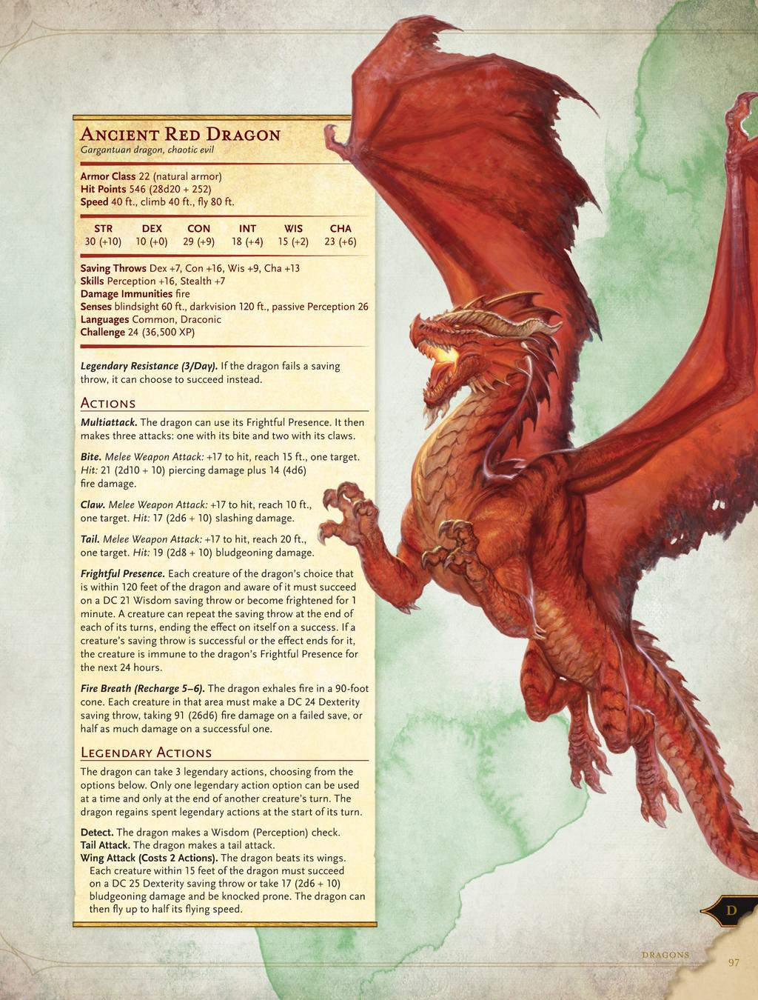
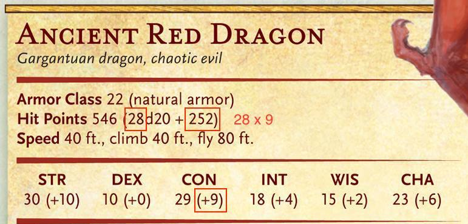

L'ordine delle sezioni di questa pagina ripercorre sequenzialmente le caratteristiche presenti nella scheda di un mostro di DnD 5e in maniera completa.

## Taglia

| Taglia       | Spazio                     |
| ------------ | -------------------------- |
| Minuscola    | 75 x 75 cm (2.5 x 2.5 ft)  |
| Piccola      | 1,5 x 1,5 m (5 x 5 ft)     |
| Media        | 1,5 x 1,5 m (5 x 5 ft)     |
| Grande       | 3 x 3 m (10 x 10 ft)       |
| Enorme       | 4,5 x 4,5 m (15 x 15 ft)   |
| Mastodontica | 6 x 6 m o più (20 x 20 ft) |

Un DM potrebbe avere bisogno di una creatura ad hoc, è possibile fare questo ritoccando una già esistente per renderla utile ai propri scopi, prendendo caratteristiche da altri mostri o usando una **variante** o **archetipo** (MM).

- La taglia di un mostro condiziona il modo in cui lo si affronta, vedere la sezione [taglia](/rules/combattimento) delle regole di combattimento (TODO: inserire il link alla sezione effettiva una volta creata).

## Tipo

Il **tipo** di un mostro definisce la sua natura fondamentale.

- Alcuni effetti (es., *magie*, *privilegi di classe*, ...) si applicano su dei tipi particolari di creature.

Il gioco include i seguenti tipi di mostro a cui non è associata alcuna regola intrinseca:
| Tipo        | Descrizione                | Esempi |
| ----------- | -------------------------- | ------ |
| Aberrazioni | Esseri totalmente alieni le cui magie sono frutto della loro mente aliena. | Mind flayer, Beholder, Aboleth, Slaadi |
| Bestie      | Creature non umanoidi che fanno parte del mondo naturale nell'ecologia fantastica. Alcune possono avere poteri magici, ma la maggior parte non sono dotate di inteligenza, parlare un linguaggio e fare parte di una società. | Tutte le varietà di animali comuni, dinosauri e le versioni giganti degli animali. |
| Celestiali  | Creature originarie dei [Piani Superiori](), sono di natura buona e solitamente fungono da messaggeri o agenti sul [Piano Mortale]() o su altri piani.  | Angeli, Couatl, Pegasi |
| Costrutti   | Anzichè nascere vengono fabbricati. Alcuni sono programmati per eseguire istruzioni semplici, altri sono senzienti ed ingrado di pensare in modo indipendente. | Golem, Modron |
| Draghi      | Creature rettili di origini antiche e di grande potenza. I draghi puri, metallici buoni e draghi cromatici malvagi, sono creature di grande intelligenza e dotate di poteri magici innati. In questa categoria vi sono anche creature imparentate alla lontana con i draghi puri, seppure meno potenti. | Draghi, Viverne, Pseudodraghi |
| Elementali  | Creature originarie dei [Piani Elementali](). Alcune di queste creature sono masse animate dal loro rispettivo elemento, mentre altre sono di forma biologica in cui è stata infusa energia elementale. | Djiin, Efreet, Azer, Cacciatori invisibili, Fatali dell'acqua |
| Folletti    | Creature magiche strettamente legate alle forze della natura che si nascondono nei boschi crepuscolari e nelle foreste nebbiose. In alcuni mondi sono strettamente legati alla [Selva Fatata]() (nota anche come [Piano di Faerie]()). Alcuni sono presenti sui [Piani Esterni]().| Driadi, Pixie, Satiri |
| Giganti     | Sovrastano gli umani e i loro simili. Generalmente hanno forma umana, anche se alcuni possono avere più teste o essere afflitti da varie deformità. Vi sono sei varietà di giganti puri:<ul><li>Giganti delle colline</li><li>Giganti delle pietre</li><li>Giganti del gelo</li><li>Giganti del fuoco</li><li>Giganti delle nuvole</li><li>Giganti delle tempeste</li></ul> |  |
| Immondi     | Creature maligne originarie dei [Piani Inferiori](). Alcuni servono una divinità, ma molti altri obbgediscono agli ordini degli arcidiavoli e dei principi dei demoni.  Talvolta, i sacerdoti e i maghi malvagi evocano gli immondi sul [Piano Materiale]() affinchè obbediscano al loro ordini. Se un celestiale malvagio è una rarità, un immondo buono è inconcepibile. | Demoni, Diavoli, Segugi infernali, Rakshasa, Yugoloth |
| Melme       | Creature gelatinose che raramente mantengono una forma fissa. Vivono per lo più sottoterra, nelle caverne e nei dungeon, dove si cibano di sporcizia, carogne o dagli sfortunati che incrociano il loro cammino. | Protoplasma nero, Cubo gelatinoso |
| Mostruosità | Creature spaventose fuori dal comune. Alcune sono il risultato di un esperimento magico andato storto (orsigufo), mentre altri sono il frutto di una terribile maledizione (es. minotauro e/o yuan ti). Sfidano ogni tentativo di essere categorizzati e in un certo senso vanno a costituire una categoria omnicomprensiva per tutte quelle creature che non rientrano in nessun altro tipo. | Orsogufo, Yuan ti, Verme purpureo, Vermeiena |
| Non morti   | Creatiure che un tempo erano vive ma che ora sono precipitate in un orrendo stato di non morte attraverso la pratica di magie necromantiche o qualche maledizione sacrilega. | Cadaveri ambulanti, Vampiri, Zombi, Fantasmi, Spettri |
| Umanoidi    | Popoli principali del mondo di DnD, civilizzati o selvaggi che siano, negli umani sono incluse una vasta gamma di specie. Dotati di linguaggio, cultura e in alcuni rari casi di poteri magici innati. | Umani, Nani, Elfi, Haalfling, Orchi, Goblin |
| Vegetali    | Creature vegetali (non flora comune). Molte di queste sono in grado di deambulare e alcuni sono carnivori. | Cumulo strisciante, Treant, Spora gassosa, Miconide |

### Descrittori

Uno o più descrittori potrebbero comparire tra parentesi dopo il tipo di mostro.

- Esempio, un orco appartiene al tipo *umanoide(orco)*

Non vi è associata alcuna regola **intrinseca**, ma certi elementi del gioco potrebbero farvi riferimento.

## Allineamento

L'allineamento di un mostro fornisce un indizio sul suo atteggiamento e sul modo in cui si comporta durante una interazione o combattimento.

- *Caotico malvagio* → difficile ragionarci e potrebbe attaccare da un momento all'altro.
- *Neutrale malvagio* → potrebbe essere disposto a negoziare.

Il DM è libero di modificare l'allineamento della scheda di un mostro, discostandosi da quello di default.

Alcune creature possono avere un **qualsiasi allineamento**, il DM lo sceglierà.

Diverse creature con intelligenza limitata non hanno alcuna cognizione di concetti come legge, caos, bene o male. Per tanto non sono in grado di fare scelte morali o etiche affidandosi all'istinto, esse risultano **senza allineamento**.

## Classe Armatura

Un mostro che possiede un'armatura o porta uno scudo possiede una **Classe Armatura** (CA) che tiene conto della sua armatura, del suo scudo e della sua [**Destrezza**](/rules/punteggi-caratteristica#destrezza).

In caso queste fossero assenti, la CA di un mostro è basata solamente sul suo modificatore di **Destrezza** e sulla sua *armatura naturale*.

- Se il mostro indossa un'*armatura naturale* o simili è indicato tra parentesi dopo il suo valore di CA.

## Punti Ferita

Un mostro solitamente muore o è distrutto quando scende a 0 punti ferita.

I punti ferita sono presentati sia come **formula di dadi** che come **valore medio**.

La [taglia](#taglia) di un mostro determina il [**Dado Vita**](/wip) da usare per calcolare i suoi punti ferita, come vediamo nella seguente tabella (**Dadi Vita in Base alla Taglia**).

| Taglia del Mostro | Dado Vita | Media dei PF per Dado Vita |
| ----------------- | --------- | -------------------------- |
| Minuscola         | d4        | 2½                         |
| Piccola           | d6        | 3½                         |
| Media             | d8        | 4½                         |
| Grande            | d10       | 5½                         |
| Enorme            | d12       | 6½                         |
| Mastodontica      | d20       | 10½                        |

- Un mostro con 2d8 punti ferita ha in media 9 punti ferita (2 x 4½)

Anche il modificatore di [**Costituzione**](/rules/punteggi-caratteristica/#costituzione) influenza i suoi punti ferita. Il modificatore di **Costituzione** va moltiplicato per il numero di Dadi Vita che possiede e il risultato si somma ai Punti Ferita correnti.

## Velocità

La velocità india di quanto il mostro può muoversi nel suo turno. Le creature prive di velocità prive di locomozione hanno una velocità terrena pari a 0.

Visioniamo alcune delle possibili forme di velocità aggiuntive.

### Nuotare

Un mostro non ha bisogno di spendere velocità extra per nuotare.

### Scalare

Il mostro non ha bisogno di spendere movimento extra per scalare.

- Può usare tutto il suo movimento o una parte di esso per muoversi sulle superfici verticali.

### Scavare

Può usare questa forma di velocità per muoversi attraverso la sabbia, terra, fango o ghiaccio. Non può scavare attraverso la solida roccia, a meno che non possieda un tratto speciali che gli consenta di farlo.

### Volare

Può usare tutto il suo movimento o una parte di esso per volare. Alcuni mostri possiedono la capacità di **fluttuare** e sono molto difficili da abbattere.

I mostri di questo tipo smettono di fluttuare quando muoiono.

## Punteggi Di Caratteristica

Ogni mostro possiede sei [punteggi di caratteristica](/rules/punteggi-caratteristica) e i loro modificatori corrispondenti.

## Tiri Salvezza

Questa caratteristica è riservata alle creature in grado di resistere a certi tipi di effetto.

- Esempio, una creatura difficile da affascinare potrebbe ottenere bonus ai [**Tiri Salvezza**](/rules/punteggi-caratteristica#tiri-salvezza) su [**Saggezza**](/rules/punteggi-caratteristica#saggezza).

La maggior parte delle creature non possiede bonus ai [**Tiri Salvezza**](/rules/punteggi-caratteristica#tiri-salvezza), in tal caso questa sezione risulterà assente nella scheda.

Il bonus al **Tiro Salvezza** è dato dalla somma del modificatore di caratteristica del mostro e del suo [**bonus di competenza per grado di sfida**](#bonus-di-competenza-per-grado-di-sfida) del mostro.

## Abilità

La sezione **Abilità** è riservata ai mostri competenti in una o più abilità.

- Esempio, un mostro molto percettivo e furtivo potrebbe epossedere dei bonus alle prove di [**Saggezza**](/rules/punteggi-caratteristica#saggezza) (Percezione) e [**Destrezza**](/rules/punteggi-caratteristica#destrezza) (Furtività).

Un bonus di abilità è dato dalla somma del modificatore di caratteristica rilevante del mostro e del suo bonus di competenza e del suo [**bonus di competenza per grado di sfida**](#bonus-di-competenza-per-grado-di-sfida)

Altri modificatori potrebbero essere applicabili.

## Vulnerabilità, Resistenze e Immunità

##  Sensi

### Percezione Tellurica

### Scurovisione

### Vista Cieca

### Vista Pura

## Linguaggi

### Telepatia

## Sfida

Il **grado di sfida** di un mostro indica quanto è grave la minaccia costituita dal mostro secondo le indicazioni per la pianificazione degli incontri (DMG).

### Bonus di Competenza per Grado di Sfida

| Sfida | Bonus di Competenza |
| ----- | ------------------- |
| 0     | +2                  |
| ⅛     | +2                  |
| ¼     | +2                  |
| ½     | +2                  |
| 1     | +2                  |
| 2     | +2                  |
| 3     | +2                  |
| 4     | +2                  |
| 5     | +3                  |
| 6     | +3                  |
| 7     | +3                  |
| 8     | +3                  |
| 9     | +4                  |
| 10    | +4                  |
| 11    | +4                  |
| 12    | +4                  |
| 13    | +5                  |
| 14    | +5                  |
| 15    | +5                  |
| 16    | +5                  |
| 17    | +6                  |
| 18    | +6                  |
| 19    | +6                  |
| 20    | +6                  |
| 21    | +7                  |
| 22    | +7                  |
| 23    | +7                  |
| 24    | +7                  |
| 25    | +8                  |
| 26    | +8                  |
| 27    | +8                  |
| 28    | +8                  |
| 29    | +9                  |
| 30    | +9                  |

### Punti Esperienza

I **punti esperienza** (PE) dati da un mostro dipendono dal suo grado di sfida.

I PE possono venire concessi:

- Quando il mostro viene sconfitto.
- Quando la minaccia viene sventata in altri modi.

| Grado di Sfida | Punti Esperienza |
| -------------- | ----------------- |
| 0              | 0 o 10            |
| ⅛              | 25                |
| ¼              | 50                |
| ½              | 100               |
| 1              | 200               |
| 2              | 450               |
| da completare ...              | ...               |

## Tratti Speciali

### Incantesimi Innati

### Incantesimi

### Poteri Psionici

## Azioni

### Attacchi in Miscia e a Distanza

### Multiattacco

### Munizioni

## Reazioni

## Uso Limitato

##  Equipaggiamento

## Creature Leggendarie

###  Azioni Leggendarie

### La Tana di una Creatura Leggendaria

#### Azioni di Tana

#### Effetti Regionali
